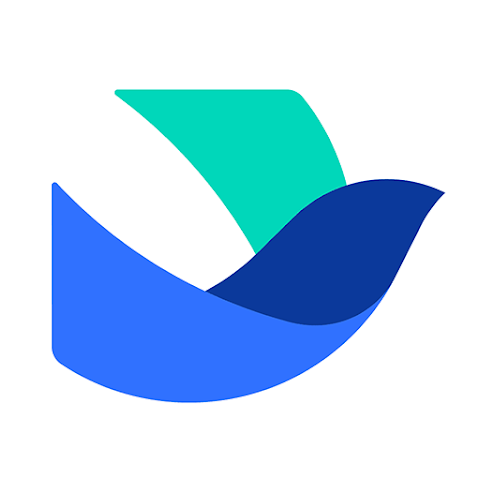

### Hi 👋

- 🔭 I’m a mobile software engineer, but use Rust 🤓.
- 🚀 I'm currently working at [Lark](https://www.larksuite.com)  ([飞书](https://www.feishu.cn)).
- 🛠️ I'm currently using Rust, Swift.
- 🌱 I’m currently learning [React](https://roadmap.sh/react?s=64df7b96ced78d293526a1d9).
- 💗 I'm lovin' hunting the coolest tech products.

### Lovin' 🤩

 &nbsp; &nbsp;
 &nbsp; &nbsp;
 &nbsp; &nbsp;
 &nbsp; &nbsp;
 &nbsp; &nbsp;
 &nbsp; &nbsp;
 &nbsp; &nbsp;
